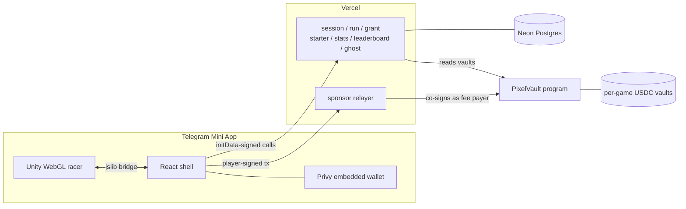

<!--
  Placeholders to fill before publishing:
    LIVE_URL      the deployed Mini App (also used in the badge below)
    TELEGRAM_BOT  the t.me link that opens the Mini App
  Every GIF slot is an HTML comment starting with "GIF" and says what to record.
  Save media under docs/media/ and uncomment the  line inside the slot.
-->

# PixelVault

**In-game purchases you can refund.** Every item holds USDC that a Solana program, not the studio, guarantees the player can take back. One racing game, three tracks, nine backed items, and one claim that takes ninety seconds to check.

[](https://github.com/Kumarutkarsh9470/PixelVault-Upgraded/actions/workflows/ci.yml)
[](#the-test-suite-and-what-each-test-catches)
[](https://explorer.solana.com/address/AANvcGamRqQccnrx3XHnynJAXh4KCdJAa2XYnazNsuoZ?cluster=devnet)
[](LICENSE)
<!-- [](https://LIVE_URL) -->

<!-- GIF 1 (hero, ~20 s, loops): finish a race on Neon Harbor -> medal and materials
     appear -> Garage: craft "Cyan Pulse" -> car shows the new underglow -> Vault:
     press "Redeem $0.21" -> USDC balance ticks up.

-->

**THE LOOP.** Race to earn materials, spend materials plus USDC to craft an item, drive with it, and redeem it whenever you like. Most of the price is locked in a vault owned by the program. Redeeming burns the item and pays that backing straight back to the player's wallet. The player never needs SOL; a relayer pays every network fee.

> **An item is a claim on USDC, not on the studio's goodwill.** Studios pick each item's backing inside a 50–95% band, the backing sits in a vault the studio can never withdraw from, and redemption has no pause switch and needs no game server. So a studio can go offline and every item it ever sold is still worth what it says on the label.

You can check the claim yourself in about ninety seconds:

1. Open the game ([TELEGRAM_BOT](https://TELEGRAM_BOT) or [LIVE_URL](https://LIVE_URL)). New players get 2 test USDC once, so the first craft is free.
2. Win a medal, open the **Garage** and craft any item. Its refund value is printed on the card before you pay.
3. Open the **Vault** and press **Redeem**. The item burns and its backing lands in your wallet. The *Protocol, live from the chain* panel underneath reads every vault balance directly from Solana, not from our database, and shows whether each one covers what it owes.

| | |
|---|---|
| **Play** | [TELEGRAM_BOT](https://TELEGRAM_BOT), or [LIVE_URL](https://LIVE_URL) in a browser |
| **Program** | [`AANvcGam…zNsuoZ`](https://explorer.solana.com/address/AANvcGamRqQccnrx3XHnynJAXh4KCdJAa2XYnazNsuoZ?cluster=devnet) on devnet |
| **Threat model** | [`docs/THREAT_MODEL.md`](docs/THREAT_MODEL.md): every attack we considered, its defence, and the test that proves it |
| **Run locally** | `node tools/serve-web.mjs deploy/racer 8091` → http://localhost:8091 |
| **Tests** | `anchor build && cargo test`: 12 program tests against litesvm, run in [CI](.github/workflows/ci.yml) on every push |

Built for the **Colosseum Crypto World's Fair** hackathon, Solana track.

## Contents

- [Who this is for](#who-this-is-for)
- [What you are looking at](#what-you-are-looking-at): the race, the garage, the vault
- [The idea, in three steps](#the-idea-in-three-steps)
- [Where this sits](#where-this-sits): against ordinary purchases, NFTs and game tokens
- [The economy](#the-economy): every item, its price, its backing and its recipe
- [What the program guarantees](#what-the-program-guarantees), and the test behind each guarantee
- [How it is built](#how-it-is-built)
- [The test suite, and what each test catches](#the-test-suite-and-what-each-test-catches)
- [Reproducing](#reproducing)
- [Honest limitations](#honest-limitations)
- [Prior work disclosure](#prior-work-disclosure)
- [Attribution and licenses](#attribution-and-licenses)

## Who this is for

**Players** who have been burned by web3 games that shut down and took their money with them. You need nothing but Telegram: sign-in creates an embedded Solana wallet, and you never hold or spend SOL.

**Studios** that want to charge more for items without asking players to trust them. Players pay the full price, but their real cost is only the unbacked margin, and the studio keeps most of that margin.

**Reviewers and auditors.** The program is about 1,200 lines of Anchor across eight instructions. Start with [`docs/THREAT_MODEL.md`](docs/THREAT_MODEL.md), then [`craft.rs`](pixelvault/programs/pixelvault/src/instructions/craft.rs) and [`redeem.rs`](pixelvault/programs/pixelvault/src/instructions/redeem.rs).

## What you are looking at

One Telegram Mini App with a React shell around a Unity WebGL game. There are three screens that matter, in the order a player meets them.

### 1. THE RACE: why does anyone want an item?

<!-- GIF 2 (~10 s): racing on Frostline: drift into a corner, boost on exit,
     overtake the Nova ghost, cross the line, medal screen.

-->

**A real game first.** Three tracks (*Neon Harbor*, a night circuit through the docks; *Dune Rush*, desert sweepers and a hairpin; *Frostline*, low grip on ice), each two laps. Drifting charges a boost. You race a ghost: *Nova*, a calibrated rival; the current leader's recorded line; or your own best.

**Medals pay materials.** Bronze, silver and gold pay 1, 2 and 3 of the track's material (Neon Shard, Sun Glass or Frost Core). Materials live off-chain and cannot be traded. They unlock the right to craft; they are never worth money on their own.

**Times are checked on the server.** Lap count, a minimum time derived from top speed, the exact number of checkpoint splits, monotonic splits and a per-segment speed limit. Rewards are capped at 12 materials per track per day.

### 2. THE GARAGE: what does crafting cost?

<!-- GIF 3 (~8 s): Garage: hover "Futura" showing price $1.00 and refund $0.90,
     craft it (one tap, no wallet popup), the car model swaps to Futura.

-->

**Every card shows two numbers: the price and the refund.** The Futura chassis costs $1.00 and holds $0.90. The player's real cost is the $0.10 difference.

**One tap, no wallet popup.** The server checks your materials, reserves them and signs a *grant* for exactly one craft. The app builds a transaction with that grant, the player's embedded wallet signs silently, and the relayer adds the fee and submits it. If the transaction never lands, the reserved materials come back once the grant expires.

### 3. THE VAULT: can I really get my money back?

<!-- GIF 4 (~8 s): Vault: "Refundable value" total, press "Redeem $0.90" on Futura,
     the item disappears, USDC rises by 0.90, the live solvency panel updates.

-->

**Redeem burns one item and pays its backing.** No market, no buyer, no studio approval. The vault is a token account owned by the game's program address, and `redeem` is the only instruction that ever moves money out of it.

**Solvency you can check.** The panel at the bottom reads every game's vault from the chain and compares it with what that game owes. Every craft, redeem and backing raise re-checks `vault balance ≥ total backing` inside the program and fails the transaction if it is not.

<!-- GIF 5 (~8 s): Vault: "Move to another game" on an item, pick a destination,
     one transaction, the old item burns and the new one appears.

-->

**Value moves between games at par.** *Move to another game* redeems an item in one game and crafts one in another inside a single transaction, so the backing never leaves the protocol and the player pays only the difference. See [Honest limitations](#honest-limitations): the second game is not playable yet.

## The idea, in three steps

**1. Every price splits three ways.** For a $1.00 item with 80% backing:

| Part | Share | Amount | Goes to |
|---|---|---|---|
| Backing | 80% of price | $0.800 | the game's vault, owed to whoever holds the item |
| Studio margin | the rest, minus the fee | $0.175 | the studio's treasury |
| Protocol fee | 12.5% of the margin | $0.025 | the protocol's treasury |

These are the exact numbers asserted in `zero_sol_player_crafts_and_redeems_with_sponsor_paying`.

**2. The band is the product.** Below 50% backing, an item is just an ordinary purchase with a small rebate. At 100%, crafting and redeeming costs nothing and could be farmed. So the program rejects any backing outside 50–95%, and the fee can never exceed 25% of the margin: both limits are constants compiled into the program.

**3. Backing can only go up.** A studio can raise an item class's backing and must deposit the difference for every unit already in circulation, in the same transaction. No instruction lowers it.

## Where this sits

| | Ordinary in-game purchase | NFT item | Per-game token | **PixelVault item** |
|---|---|---|---|---|
| Can the player get money back? | No | Only if a buyer shows up | Only through pool liquidity | **Yes: fixed backing, paid by the program** |
| Survives the studio shutting down? | No | The token does; its price rarely does | The token does; liquidity rarely does | **Yes: redeeming needs no server** |
| Who sets the price | Studio | Market | Pool | **Studio, inside the backing band** |
| Moving value to another game | Impossible | Sell, then buy | Swap through pools | **One transaction, at par** |

## The economy

Prices and backing are fixed per item class on-chain. Recipes are enforced by the game server when it signs a grant. Source: [`web/src/data/catalog.json`](web/src/data/catalog.json).

**Neon Racer**

| Item | Type | Price | Backing | Refund | Recipe |
|---|---|---|---|---|---|
| Futura | chassis | $1.00 | 90% | $0.90 | 3 Neon Shard, 2 Frost Core |
| Street | chassis | $0.60 | 80% | $0.48 | 3 Sun Glass |
| Hot Hatch | chassis | $0.60 | 80% | $0.48 | 2 Sun Glass, 2 Neon Shard |
| Cyan Pulse | underglow | $0.30 | 70% | $0.21 | 2 Neon Shard |
| Solar Flare | underglow | $0.30 | 70% | $0.21 | 2 Sun Glass |
| Aurora | underglow | $0.30 | 70% | $0.21 | 2 Frost Core |
| Magenta Streak | trail | $0.25 | 60% | $0.15 | 1 Neon Shard, 1 Sun Glass |
| Ion | trail | $0.25 | 60% | $0.15 | 1 Frost Core, 1 Neon Shard |
| Genesis Gold | trail, **100 ever** | $1.00 | 95% | $0.95 | 3 of each material |

**Glyph Forge** (second studio, registered on-chain; see [limitations](#honest-limitations))

| Item | Type | Price | Backing | Refund | Recipe |
|---|---|---|---|---|---|
| Neon Frame | frame | $0.50 | 80% | $0.40 | none |
| Obsidian Frame | frame | $0.90 | 90% | $0.81 | none |

## What the program guarantees

Each guarantee is enforced by the program and covered by a named test in [`test_vault.rs`](pixelvault/programs/pixelvault/tests/test_vault.rs). The full table of attacks, including the backend and relayer, is in the [threat model](docs/THREAT_MODEL.md).

| Guarantee | How | Test |
|---|---|---|
| The studio cannot take the backing | Only `redeem` signs for the vault, and it pays one unit's backing to the holder who burns it | `zero_sol_player_crafts_and_redeems_with_sponsor_paying` |
| Redemption cannot be paused | Pause flags stop crafting only; `redeem` never reads them | `pause_stops_crafting_but_never_redemption` |
| Backing never goes down | `raise_backing` accepts only a higher ratio and tops up every unit in circulation | `raising_backing_tops_up_every_unit_in_circulation` |
| Backing stays inside 50–95% | Checked at item class creation | `backing_ratio_outside_band_is_rejected` |
| No item without gameplay approval | `craft` requires an Ed25519 grant from the game's registered signer, bound to program, game, class, player, sequence and expiry | `craft_without_grant_is_rejected`, `grant_from_wrong_signer_is_rejected`, `grant_for_another_class_is_rejected` |
| A grant works once, briefly | Per-player on-chain sequence number; 180-second expiry | `replayed_grant_is_rejected`, `expired_grant_is_rejected` |
| Launch losses are bounded | Per-player, per-game and global backing caps; per-class supply caps | `per_player_cap_is_enforced`, `supply_cap_is_enforced` |

## How it is built



| Path | What it is |
|---|---|
| [`pixelvault/`](pixelvault) | Anchor program: protocol, game vaults, Token-2022 item classes, craft, redeem, raise backing; litesvm tests |
| [`game/`](game) | Unity 6 racing game for WebGL: car physics, procedural tracks and scenery, ghosts, bloom, and a quality governor that drops effects on slow phones |
| [`web/`](web) | React app around the game: Telegram login, Privy wallet, garage, vault, ranks, settings |
| [`deploy/racer/`](deploy/racer) | Vercel deployment: the assembled builds plus API functions and the database schema |
| [`tools/`](tools) | Devnet bootstrap, deploy assembly, DB migration, local server, relayer attack tests, track calibration |

**A craft, end to end.** (1) The app asks `/api/grant` for a craft. The server verifies the Telegram login, reserves the recipe's materials and records the grant in one serializable statement, then signs a digest of program, game, class, player, sequence and expiry. (2) The app builds an Ed25519 verification instruction followed by `craft`, and the embedded wallet signs. (3) `/api/sponsor` refuses any transaction that touches a program other than PixelVault, Ed25519 or Memo, uses an address lookup table, or uses the sponsor for anything except `craft`'s rent payer. Then it co-signs and submits. (4) The program verifies the grant, moves the backing to the vault and the margin to the two treasuries, checks the caps and solvency, and mints one unit.

## The test suite, and what each test catches

`cargo test` runs these against litesvm with the compiled program. Each adversarial test asserts the program's specific error code, not just a failure.

| Test | What would have to be broken for it to fail |
|---|---|
| `zero_sol_player_crafts_and_redeems_with_sponsor_paying` | The production path: a player with zero SOL crafts with a grant, the sponsor pays, every USDC split is exact, and redeeming returns exactly the backing |
| `craft_accounts_are_distinct` | Two roles in `craft` collapsing into one account |
| `backing_ratio_outside_band_is_rejected` | The 50–95% band |
| `replayed_grant_is_rejected` | Single-use grants |
| `expired_grant_is_rejected` | Grant expiry |
| `grant_from_wrong_signer_is_rejected` | Grant signer check |
| `grant_for_another_class_is_rejected` | The digest binding a grant to one item class |
| `craft_without_grant_is_rejected` | The requirement that an Ed25519 verification comes first |
| `pause_stops_crafting_but_never_redemption` | Redemption staying open during a pause |
| `raising_backing_tops_up_every_unit_in_circulation` | Raised backing being fully funded |
| `per_player_cap_is_enforced` | The per-player launch cap |
| `supply_cap_is_enforced` | Limited editions |

The relayer has its own attack script, [`tools/test-sponsor.mjs`](tools/test-sponsor.mjs), run against a live server on devnet: it tries to drain the sponsor with a transfer, attach a priority fee, and use the sponsor as an ordinary account.

## Reproducing

**Program** (Solana CLI and Anchor CLI 1.2.0; the tests sign as the protocol admin, so `~/.config/solana/id.json` must be the key in [`constants.rs`](pixelvault/programs/pixelvault/src/constants.rs)):

```bash
cd pixelvault
anchor build
cargo test
```

The workspace pins Rust 1.98.1 for host builds (tests and IDL). On-chain binaries are compiled by the Solana toolchain's own compiler.

**Devnet economy** (creates a mock USDC mint, the protocol, both games and every item class, then writes `web/src/data/chain.json`; safe to re-run):

```bash
node tools/setup-devnet.mjs
node tools/sync-data.mjs
```

**Web app:**

```bash
cd web && npm install && npm run build
```

**Game:** open `game/` in Unity 6000.0.84f1 and run *PixelVault → Build Web*, or headless with `-executeMethod GameBuilder.BuildWeb`.

**Assemble and serve** (copies the Unity and web builds plus shared data into `deploy/racer`):

```bash
node tools/assemble-deploy.mjs
node tools/db-migrate.mjs
node tools/serve-web.mjs deploy/racer 8091
```

**Environment** for the API functions: `DATABASE_URL`, `TELEGRAM_BOT_TOKEN`, `GRANT_SIGNER_SECRET`, `SPONSOR_SECRET_KEY`, `FUNDER_SECRET`, and optionally `RPC_URL` and `STARTER_MICRO_USDC`. Secret keys are JSON byte arrays.

## Honest limitations

- **The second game is not playable yet.** Glyph Forge is registered on-chain as its own studio with its own vault and two item classes, but it has no gameplay, its items need no materials, and it shares the racer's grant signer and backend. Moving value between games works on-chain today; a real second game, run as an independent studio, is next.
- **Gameplay is checked for plausibility, not replayed.** A skilled cheater who produces realistic checkpoint times can earn materials they didn't drive for. Every item is still paid for in USDC, so this cannot extract money.
- **The relayer is not rate-limited yet.** It only signs safe PixelVault transactions, but it does not yet tie requests to a Telegram login or cap them per player.
- **Devnet only.** USDC is a mock mint and the starter grant is minted from it. A mainnet build needs a new admin key in [`constants.rs`](pixelvault/programs/pixelvault/src/constants.rs), and the admin will move to a multisig.
- **Not audited.** Launch caps (including $25 of backing per player per game) bound the loss from any undiscovered bug.

## Prior work disclosure

This project builds on an idea the author explored in an earlier hackathon: [PixelVault on Initia](https://github.com/Kumarutkarsh9470/INITIA_Hack), a cross-game economy built around per-game tokens, an AMM and ERC-6551 player accounts on an Initia MiniEVM rollup.

This repository is a new codebase started during the Crypto World's Fair. It shares no code with that project and deliberately abandons its core model: the per-game-token design is replaced by USDC-backed items with a protocol-enforced redemption floor, on Solana.

## Attribution and licenses

- Code: [Apache License 2.0](LICENSE).
- 3D models and textures in `game/Assets/Resources/Kenney/`: [Kenney](https://www.kenney.nl) Car Kit and Racing Kit, CC0 1.0.
- Built with [Anchor](https://www.anchor-lang.com), [Unity](https://unity.com), [Privy](https://www.privy.io), [Vercel](https://vercel.com) and [Neon](https://neon.tech).
